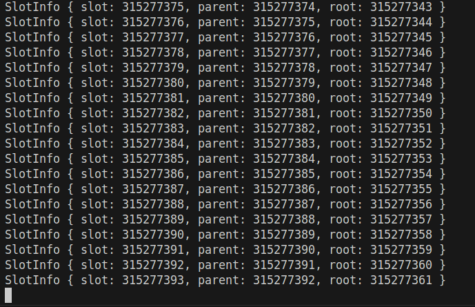
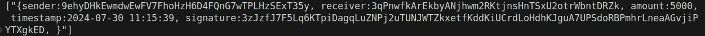

# Solana Aggregator

This is a binary application that aggregates transaction data from Solana's devnet, stores them in a database, and exposes a RESTful API to query data.

## Pre-requisites
* Rust programming language
    - This project was built with Rust V1.79.0
* Sqlite 
    - This project used V3.31.1
* Access to Solana web socket / RPC urls
    - This project used urls from [helius](https://www.helius.dev/)

## Code Discovery

### Brief Introduction

- **`aggregate_data` function**: This asynchronous function initiates the data aggregation process by connecting to the Solana blockchain, retrieving transaction data, and storing it in a database. It runs in a loop for a specified number of iterations, fetching and processing blocks of transactions.

- **`web_server` function**: This function starts an HTTP server that listens on `127.0.0.1:8080` and handles incoming requests to query transaction data from the database. It sets up the necessary routes and query handlers.

### Output of `aggregate_data` Function

The `aggregate_data` function processes blocks of transactions from the Solana blockchain and stores relevant transaction details in the database. it outputs information about the slots that have been aggregated.

### `MAX_ITERATIONS` Constant

The `MAX_ITERATIONS` constant, initialized as `100`, specifies the number of iterations the `aggregate_data` function will run. Each iteration involves fetching and processing a block of transactions from the blockchain. If you want to have more blocks aggregated, you can change the `MAX_ITERATIONS` constant.

### Web Server Paths and Queries

The web server provides an endpoint for querying transaction data stored in the database:

- **Path**: `/transactions`
  
- **Query Parameters**:
  - `start_date` (optional): Filters transactions by a minimum timestamp. Should be in the form `"%Y-%m-%d %H:%M:%S"` (quotations included).
  - `end_date` (optional): Filters transactions by a maximum timestamp. Should be in the form `"%Y-%m-%d %H:%M:%S"` (quotations included).
  - `signature` (optional): Filters transactions by a specific signature.
  - `sender` (optional): Filters transactions by the sender's public key.
  - `receiver` (optional): Filters transactions by the receiver's public key.

Users can construct HTTP GET requests with these query parameters to retrieve filtered sets of transactions. For example:

```bash
GET http://127.0.0.1:8080/transactions?start_date="2023-01-01 00:00:00"&end_date="2023-01-31 23:59:59"&sender=sender_public_key
```

This request retrieves all transactions between January 1, 2023, and January 31, 2023, sent by the specified sender.

## Usage

```bash
export API_KEY=//add your helius api key
```

Run the command with two environment variables:
```bash copy
ws_url=wss://devnet.helius-rpc.com/?api-key=$API_KEY rpc_url=https://devnet.helius-rpc.com/?api-key=$API_KEY cargo run 
```

## Example Run

* After running the command line with the environment variables, we get the following on standard output:




    - This output is the slots that are being aggregated from the devnet, which are later parsed for transaction info.

* Now we request ```localhost:8080/transactions?signature=3zJzfJ7F5Lq6KTpiDagqLuZNPj2uTUNJWTZkxetfKddKiUCrdLoHdhKJguA7UPSdoRBPmhrLneaAGvjiPYTXgkED```:
